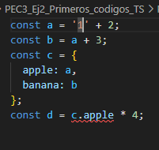

## Ej2 code1.ts
El propio IDE ya indica que, a, b y d son números y c es un objeto

Si hacemos esa modificación, podremos ver que ahora a pasa a ser un string, lo cual impide que se haga la operación de d correctamente.
Esto es porque no son del mismo tipo, una variable es un string y la otra un numero.
En javascript esta operación se puede hacer porque la resolveria con una concatenación de strings pese a que en raras ocasiones se busca eso.
En cambio, TS tiene la ventaja que esto no lo permite porque no son el mismo tipo de variable.

## 1.Para cada uno de los valores del fichero code2.ts, ¿Qué tipo de datos inferirá TypeScript? Explica por qué se ha inferido este tipo de datos.
a: number (es un número)
b: string (es una agrupación de caracteres dentro de '')
c: string (es una agrupación de caracteres dentro de '')
d: boolean[] (valores con [] y todo bools)
e: object (valores con {})
f: (boolean | number)[] (valores con [] de tipo bool o number, podria ser un array o una tupla)
g: number[] (array de solo números)
h: null (porque almacena el null)

## 2.¿Por qué se dispara cada uno de los errores del fichero code3.ts?
- Error en linea 2: tanto en js como en ts, una variable const no se puede reasignar. Se puede mutar como con un array, pero no se le puede cambiar el valor porque las const no se reasignan.
- Error en linea 6: ts sabe que el array j es un array de solo numbers, por lo que añadir un string no funcionará.
- Error en linea 8: never establece que esa función nunca acabará, por lo que no retornará nada. No se puede asignar nada a algo que como inferencia tenga un never porque en el momento que entre no podrá salir.
- Error en linea 11: unkown hace que la variable no sepas que valor puede contener o que tipo puede ser. Acceder a la variable da un error porque lo que te llega podria no ser del tipo que te permite hacer la operación o usar cierto método.

## 3.¿Cuál es la diferencia entre una clase y una interface en TypeScript?
Principalmente, la clase se usará para almacenar objectos y podrá incluir métodos y propiedades. Es decir con ella se podrán crear elementos.
La interfaz le da forma a estos objetos pero no entra en la implementación de estos, es decir que con la interfaz no podrás realmente crear nada nuevo.